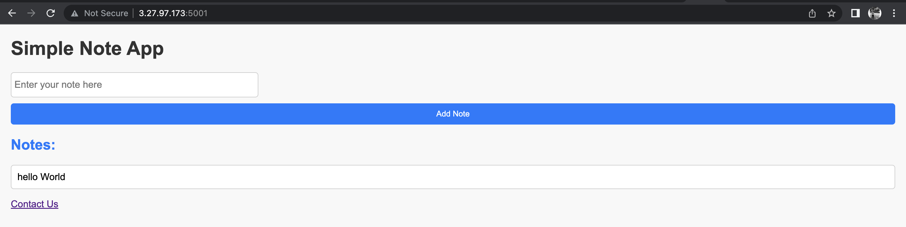
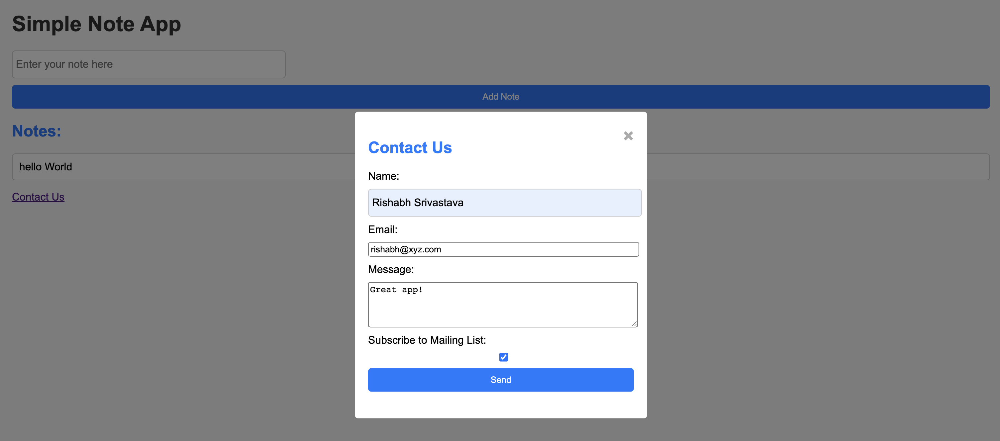
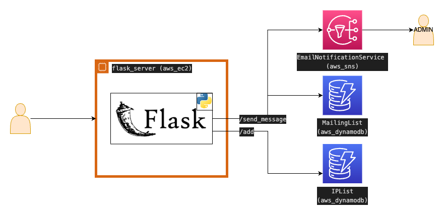

# Stupid Simple Note Taking Flask Application

Welcome to the Simple Note Taking Flask Application! This web application allows users to enter and manage notes. Additionally, users can conveniently contact the admin of the web app with any queries or feedback. Please read the following sections to get started.

## Features/API's
### `/add`
* Adds a note to the list of notes for the current user. 
* When the user click's `Add Note`, the user's IP address and browser agent details are streamed in a AWS Dynamodb table. 

### `/send_message`
* Allows users to contact the admin with custom messages. This is done by sending user details via AWS SNS. 
* Further, the user is given the option to signup for the mailing list. The mailing list is stored on AWS Dynamodb Table. 
* 

## Getting Started
### Prerequisites
* Python 3.x
* Flask
* AWS CLI (ref: https://docs.aws.amazon.com/cli/latest/userguide/getting-started-install.html#getting-started-install-instructions)
* AWS CDK (ref: https://docs.aws.amazon.com/cdk/v2/guide/getting_started.html#getting_started_install)
* SSH (is installed already in most machines)

### Infarstructure Deploy
* Make sure AWS CLI crednetials are loaded (ref: https://docs.aws.amazon.com/cli/latest/userguide/cli-configure-envvars.html)
* Navigate to `cd infra` and execute `cdk bootstrap; cdk deploy` and wait for the magic to happen. 
* 

### Application Deploy
* Connect to your server using the private keys. `ssh -i private-key.pem ec2-user@<ip-address-server>`
* Replicate `/app` folder in the server using `mkdir` and `vim`. 
* Install requirements `pip install -r requirements.txt`. 
* Run the app! 🎉 `python3 app.py`

### New Ideas
* Dump notes being submitted to AWS S3 (Amazon's object storage service) as json. 
* Create a user signup page and store user details on AWS RDS (Amazon's database service). 
* 